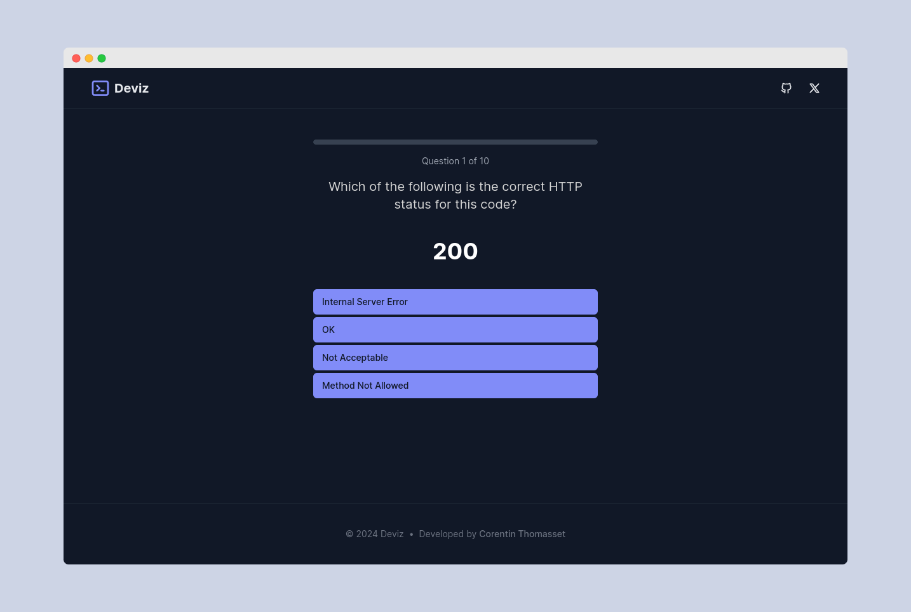

# Deviz

WIP

A minimal and simple quiz web app for devs -> [deviz.corentin.tech](https://deviz.corentin.tech)

## Setup

Make sure to install the dependencies:

```bash
pnpm i
```

## Development Server

Start the development server on `http://localhost:3000`:

```bash
pnpm dev
```

## Production

Build the application for production:

```bash
pnpm run build
```

Locally preview production build:

```bash
pnpm run preview
```
